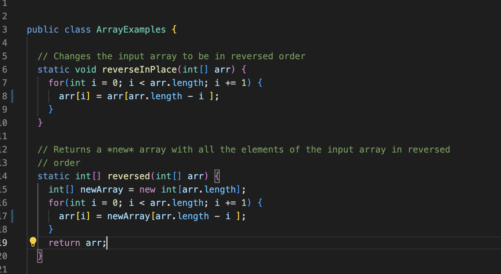
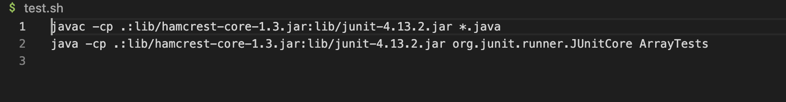
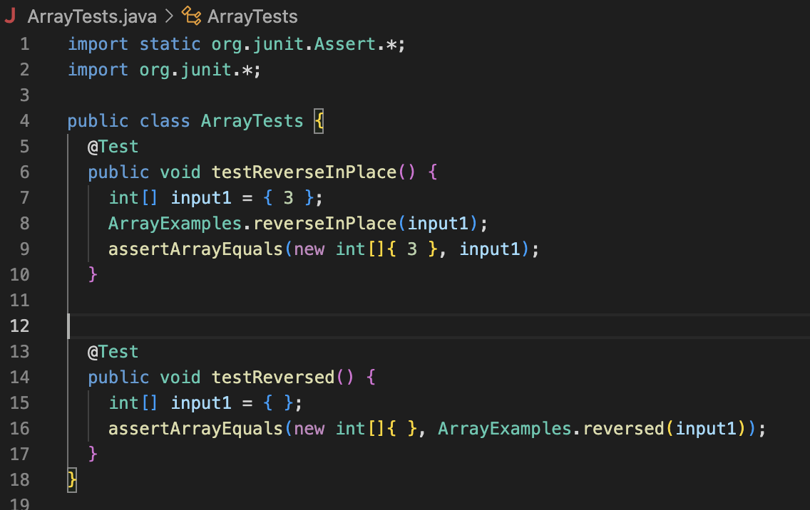
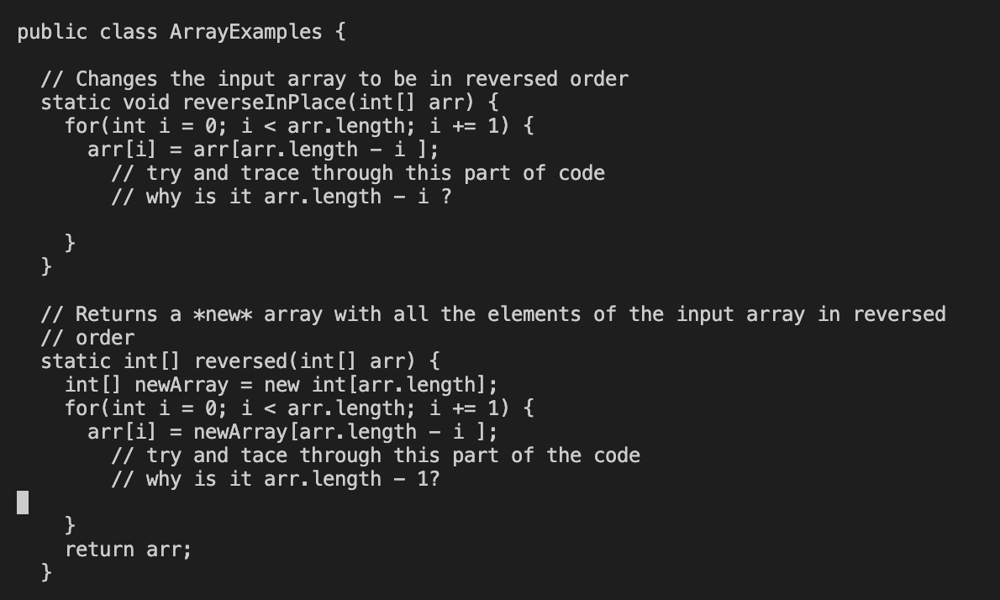
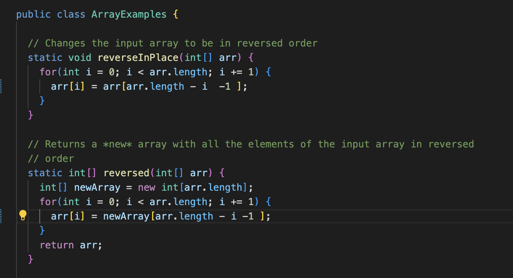
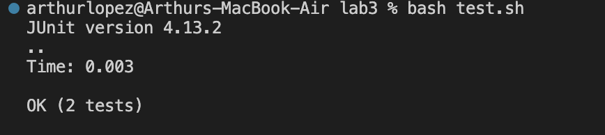

# CSE15L LAB 5 REPORT 

For the lab report this week, I am going to replicate an EdStem conversation that a student and a TA would have. 

**Part 1**

**Student**

Hello, I'm using a mac operating system, and I'm coding on VS Code for Lab 3. I'm not sure why my code is failing the test. 
I created a test.sh file to test my files when I call <bash test.sh>, I'm prompted with an index out of bounds error. 

Heres my code


Heres my test.sh file 

 
 
Heres my output

 
Thank you!
 
 
 
**TA Response**

Hi! (insert student name)
It seems like you have two bugs in your code in reverseInPlace() and reversed(), more specifically inside the for loops. 
I wrote down some hints for you in the image below. 
 

Good Luck!
 
 
**Student**
Hey! Just wanted to say thank you for the help. 
After tracing the code through the for loops, I realized why I was getting an index out of bounds error and fixed it for both methods. 
 
Here is how my code looks like after debugging!


 
 ``` 
changed 
arr[i] = arr[arr.length - i];
TO 
arr[i] = arr[arr.length - i - 1];
 ``` 

 
And here is how my test results look like after debugging!  
 
 

 
